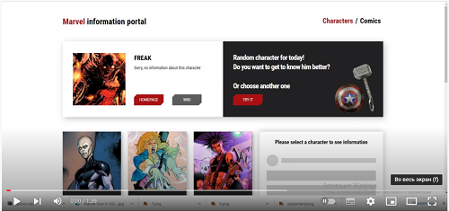
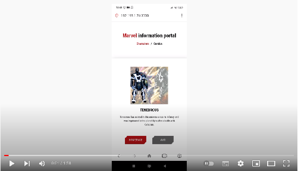

Ссылка на приложение: http://marvel.ykoshelev.ru/

### О чем проект
Это информационный портал по вселенной Марвел реализованный через Marvel API.

Приложение реализовано на React + Redux Toolkit, 

### Как работает приложение
Приложение получает данные от API по персонажам вселенной Marvel и загружает их в глобальное хранилище, в дальнейшем рендерит их на странице, за один раз загружается 9 персонажей, так же реализована подгрузка персонажей, поиска персонажа по имени и рандомная загрузка персонажа. Также при выборе персонажа реализована возможность просмотреть комиксы, в которых данный персонаж участвовал

В приложении есть отдельная страница для комиксов куда приходят данные по свежим комиксам с описанием и ценой, все эти загруженные данные так же хранятся в глобальном хранилище.

В процессе перехода от персонажей к комиксам используются данные из глобального стейта без дозагрузки из API

Приложение адаптировано под мобильные устройства

Link to the application: http://marvel.ykoshelev.ru/

### What is the project about
This is an information portal on the Marvel universe implemented through the Marvel API.

The application is implemented on React + Redux Toolkit,

### How the app works
The application receives data from the API on the characters of the Marvel universe and uploads them to the global storage, then renders them on the page, 9 characters are loaded at a time, character loading, character search by name and random character loading are also implemented. Also, when choosing a character, it is possible to view the comics in which this character participated

The application has a separate page for comics where data on fresh comics with a description and price come, all these uploaded data are also stored in a global repository.

During the transition from characters to comics, data from the global state is used without reloading from the API

The application is adapted for mobile devices

### Демонстрация / Demonstration

#### Версия для ПК / PC version

#### Мобильная версия / Mobile version

